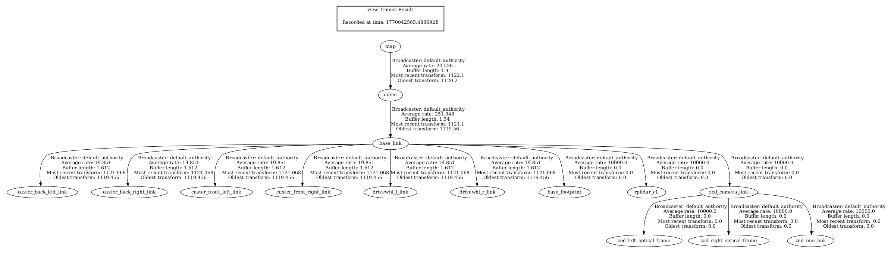
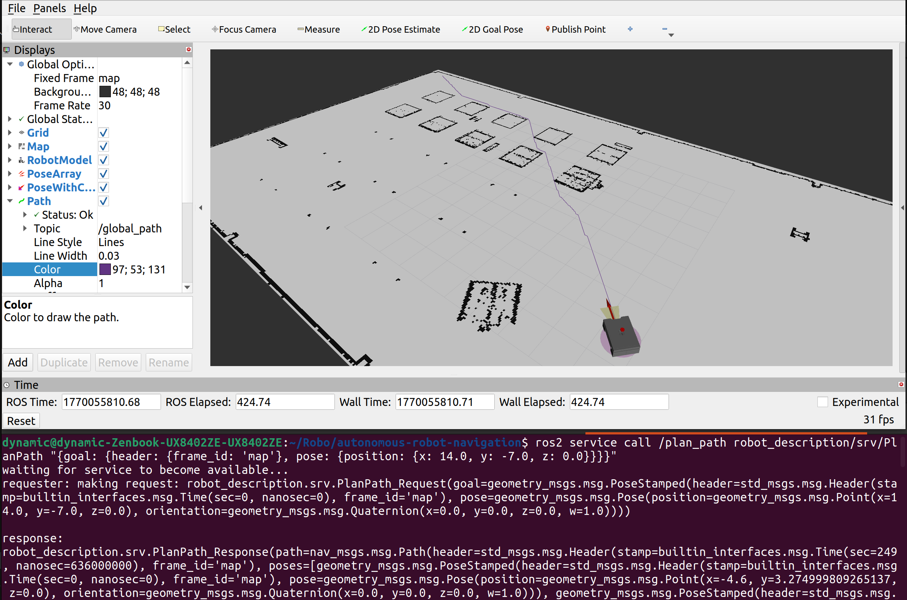

# 📌 Task 1: Localization and Map Handling

## 📖 Theory & Objective

### 🛰️ Map-Based Localization
Localization is the process of estimating the robot's pose $(x, y, \theta)$ relative to a global map. We utilize the **Adaptive Monte Carlo Localization (AMCL)** algorithm, which is a probabilistic approach based on the **Particle Filter**.

* **Particle Filter Mechanism:** AMCL represents the robot's possible positions using a set of "particles." Each particle is a guess of where the robot might be.
* **Prediction Step:** As the robot moves, particles are shifted based on odometry data.
* **Correction Step:** When a Lidar scan is received, particles that match the map's geometry are given higher weights.
* **Resampling:** Over time, particles "converge" or cluster around the most likely position of the robot.


###  TF Tree Structure
A consistent Coordinate Transform (TF) tree is critical for navigation. Our system maintains the following hierarchy:
`map` $\rightarrow$ `odom` $\rightarrow$ `base_link`


* **Map to Odom:** This transform is published by **AMCL** to correct the "drift" in odometry.
* **Odom to Base Link:** Published by the robot's odometry system (e.g., wheel encoders).


## ⚙️ Technical Implementation

### 🗺️ Map Handling & Origin Correction
The occupancy grid map (`depot.pgm`) was processed with a resolution of **0.05 m/pixel**. To align the map's center with the Gazebo world origin $(0,0)$, the `origin` parameter in the YAML file was calculated based on the image dimensions ($604 \times 307$ px):

* **Calculated Origin:** `[-15.1, -7.675, 0.0]`

### 🛠️ Configuration (AMCL & Map Server)
The system parameters are defined in `amcl_config.yaml`. Key configurations include:

| Parameter | Value | Description |
| :--- | :--- | :--- |
| `min_particles` | 500 | Minimum number of particles in the filter |
| `max_particles` | 2000 | Maximum particles for higher uncertainty |
| `update_min_d` | 0.1m | Distance threshold to trigger a filter update |
| `scan_topic` | `/gz_lidar/scan` | Source of Lidar data from Gazebo bridge |
| `odom_model_type` | `diff` | Kinematic model for differential drive |


## Execution Workflow

### Launching the Stack
The system is initialized via a single Python launch file:
```bash
ros2 launch robot_description localization.launch.py

```

### 🆕 Testing Methodology (Teleoperation)

To validate the localization performance and observe the particle filter's behavior in real-time, the `teleop_twist_keyboard` node was utilized:

* **Manual Intervention:** By running `ros2 run teleop_twist_keyboard teleop_twist_keyboard`, velocity commands were published to move the robot manually.
* **Validation Strategy:** Since AMCL updates are distance-based (`update_min_d: 0.1m`), manual driving was essential to trigger the filter's update cycle. This allowed the algorithm to compare continuous Lidar scans against the map features, leading to the successful convergence of the particle cloud.

### Demonstration Procedure

1. **Initial Pose Setup:** Used the `2D Pose Estimate` tool in RViz to set an incorrect initial guess, simulating localization recovery.
2. **Convergence Test:** Controlled the robot using `teleop_twist_keyboard`.
3. **Observation:** As the robot moved, the Lidar scans matched against the map features, causing the dispersed particle cloud to converge onto the robot's true pose in both Gazebo and RViz.


## 🛠️ Verification and Results
The following video demonstrates:

1. The stability of the **TF Tree**.
2. The robot's ability to recover from an incorrect initial pose estimate.
3. Successful **Particle Cloud Convergence** after a few seconds of movement.

### 🎥 Demonstration Video


▶️ Full-resolution video:  
[Click here to watch the MP4](media/demo1.mp4)


---


# 📌 Task 2: Global Path Planning Server (A*)

## 📖 Theory & Objective

### 🔍 A* Search Algorithm

The goal of this task is to implement a global path planner that calculates the most efficient, collision-free route from the robot's current position to a designated goal. We utilized the **A* (A-star)** algorithm, which is an informed search strategy known for its optimality and efficiency.

* **Heuristic Approach:** A* guides its search by minimizing the total cost function: .
* **Cost to Reach ():** The actual cost from the starting node to the current node . In our grid, straight moves cost **1.0** and diagonal moves cost **1.414**.
* **Heuristic Estimate ():** The estimated cost from node  to the goal. We implemented **Euclidean Distance** as an admissible heuristic, ensuring the shortest path is always found.
* **Optimal Path:** The algorithm maintains an "Open List" (Priority Queue) to explore nodes with the lowest  first, ensuring efficiency even in complex environments.

### 🛰️ Service-Based Architecture

Unlike continuous processes, the planner operates as a **ROS 2 Service Server**. It remains idle until a request is received, providing a path response only when triggered. This architecture is ideal for global planning as it saves computational resources.


## ⚙️ Technical Implementation

### 🗺️ Grid-Based Mapping

The occupancy grid map provided by `nav2_map_server` is interpreted as a 2D graph where each cell is a node:

* **Cell Traversal:** Cells with a value of `0` (free) or `-1` (unknown) are considered traversable.
* **Coordinate Mapping:** The node performs real-time conversion between world coordinates (meters) and grid indices (pixels) using the map's resolution and origin.

### 🛠️ Configuration & Dependencies

The planner is integrated into the system with the following specifications:

| Component | Detail | Description |
| --- | --- | --- |
| **Service Name** | `/plan_path` | Custom service defined in `PlanPath.srv` |
| **Input (Request)** | `PoseStamped` | The target destination in the `map` frame |
| **Output (Response)** | `nav_msgs/Path` | A sequence of poses forming the global route |
| **Pose Source** | `/amcl_pose` or **TF** | Uses AMCL data with a TF fallback for the start point |


## 🚀 Execution Workflow

### Launching the Planner

The A* node is launched alongside the localization stack to ensure map and pose data are available:

```bash
ros2 launch robot_description localization.launch.py

```

### 🆕 Testing Methodology (Service Call)

To validate the path planning without a full navigation executive, we perform a direct service call via terminal:

* **Command:** `ros2 service call /plan_path robot_description/srv/PlanPath "{goal: {header: {frame_id: 'map'}, pose: {position: {x: 2.0, y: 5.0, z: 0.0}}}}"`
* **Validation Strategy:** By providing coordinates separated by obstacles (walls), we verify the algorithm's ability to find a path that obeys the occupancy grid constraints and optimizes distance.

### Demonstration Procedure

1. **System Readiness:** Ensure the robot is localized using the **2D Pose Estimate** tool in RViz.
2. **Goal Selection:** A destination is sent to the `/plan_path` service.
3. **Visualization:** The computed path is immediately published to the `/global_path` topic and visualized in RViz as a continuous line.

---

## 🛠️ Verification and Results

The demonstration confirms the following:

1. **Algorithm Correctness:** The A* algorithm successfully finds the shortest path while avoiding black-listed (obstacle) cells.
2. **Service Reliability:** The server handles requests and returns a valid `nav_msgs/Path` message.
3. **Visualization:** Successful rendering of the global plan in RViz, showing clear obstacle avoidance.

### 🖼️ Planned Path Result



---

# 🏆 Bonus Task: Classical Control for Path Following (PID & MPC)

## 📖 Theory & Objective

The objective of this task is to implement and compare two classical control strategies—**PID (Proportional-Integral-Derivative)** and **MPC (Model Predictive Control)**—to enable the robot to follow the global path generated by the A* planner.

### 🎮 1. PID Controller (Reactive Approach)

The PID controller works by calculating an "error" value as the difference between a desired setpoint (the path) and a measured process variable (robot pose).

* **Cross-Track Error:** The distance between the robot's current position and the lookahead point.
* **Heading Error:** The difference between the robot's current yaw and the required angle to reach the target.
* **Characteristics:** It is computationally lightweight and easy to implement but reacts only to past and current errors.

### 🔮 2. MPC Controller (Predictive Approach)

Model Predictive Control is a more advanced strategy that uses a simplified model of the robot's kinematics to predict its future state over a specific **Prediction Horizon**.

* **Horizon Planning:** Instead of looking at a single point, it evaluates a sequence of future points (steps).
* **Optimization:** It minimizes a cost function that balances the distance to the path against the smoothness of the control effort.
* **Characteristics:** It "anticipates" curves, allowing for much smoother motion at higher speeds compared to PID.


## ⚙️ Technical Implementation

### 📐 Path Tracking Logic

Both controllers utilize a **Lookahead Distance** strategy. The robot doesn't just aim for the nearest point; it targets a point further along the path to ensure stability and prevent oscillation.

### 🛠️ Configuration & Dependencies

| Component | Detail | Description |
| --- | --- | --- |
| **Input Topic** | `/global_path` | List of waypoints provided by the A* Server |
| **Pose Source** | **TF** (`map` → `base_link`) | High-frequency transform data for real-time tracking |
| **Output Topic** | `/cmd_vel` | Velocity commands (, ) sent to the robot |
| **Frequency** | **20 Hz** | Consistent control loop for stable performance |


## 🚀 Execution Workflow

We developed two dedicated launch files to allow independent testing of each controller.

### 🔵 Option A: Launching PID Controller

```bash
ros2 launch robot_description pid_controller.launch.py

```

### 🟢 Option B: Launching MPC Controller

```bash
ros2 launch robot_description mpc_controller.launch.py

```

### 🆕 Testing Methodology

1. **Initialize:** Run the localization and A* planner nodes.
2. **Generate Path:** Use the `/plan_path` service to create a global route.
3. **Execute:** Run one of the controllers. The robot will automatically start following the line until it reaches the goal within the `goal_tolerance`.


## 🛠️ Verification and Results

### 📊 Comparative Analysis

| Metric | PID Performance | MPC Performance |
| --- | --- | --- |
| **Path Accuracy** | High on straight lines, slight overshoot in corners. | Superior tracking in both straight and curved segments. |
| **Smoothness** | Decent, but prone to jerky movements if gains are high. | Exceptionally smooth due to predictive horizon. |
| **Cornering** | Reactive; starts turning only when the error increases. | Proactive; anticipates turns before reaching them. |

### 📽️ Performance Demonstrations

<table style="width:100%">
  <tr>
    <th>PID Controller (Reactive)</th>
    <th>MPC Controller (Predictive)</th>
  </tr>
  <tr>
    <td>
      <video src="media/pid.mp4" width="400" muted autoplay loop></video>
    </td>
    <td>
      <video src="media/mpc.mp4" width="400" muted autoplay loop></video>
    </td>
  </tr>
</table>
---
