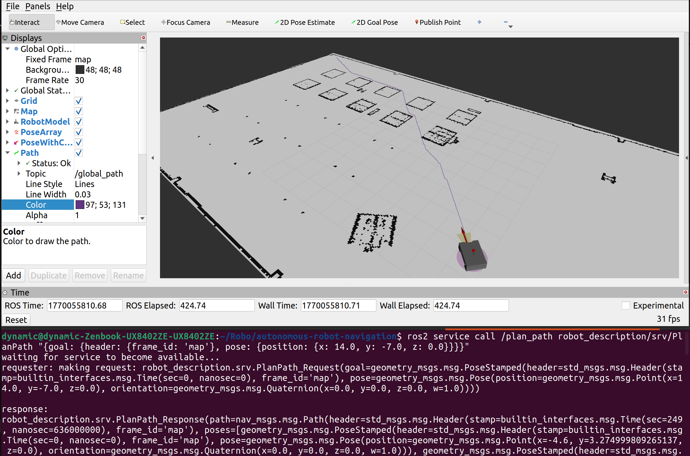
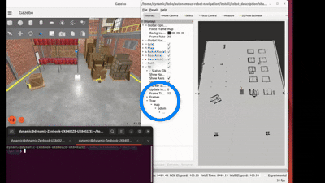

# autonomous-robot-navigation

A ROS 2 navigation stack that solves the same "follow a path" problem three different ways: a classical PID controller, a Model Predictive Controller, and a DDPG reinforcement-learning agent trained from scratch in PyTorch, all running on top of the same AMCL localization and A* global planner.

## What it does

- **Localization**: AMCL-based particle-filter localization against a pre-built occupancy grid map, launched as part of the main stack and validated by deliberately setting a wrong initial pose in RViz and confirming the particle cloud converges to the true pose as the robot drives.
- **Global planning**: a custom A* planner exposed as a ROS 2 **service** (`/plan_path`) rather than a continuously running node — it sits idle until a `PoseStamped` goal comes in and returns a `nav_msgs/Path`, using Euclidean-distance heuristics over the occupancy grid with real-time world-to-grid coordinate conversion.
- **Path following, three ways**, all consuming the same `/global_path` output from the planner:
  - A **PID controller** using cross-track and heading error against a lookahead point on the path.
  - An **MPC controller** that predicts the robot's trajectory over a horizon and optimizes a cost balancing path error against control smoothness.
  - A **DDPG reinforcement-learning agent** (actor/critic networks + replay buffer implemented from scratch in PyTorch, no `stable-baselines`) trained in Gazebo to do line-following from a 4-dimensional observation (distance to goal, heading error, minimum laser range, current velocity) with a shaped reward (goal bonus, collision penalty, heading-alignment term, progress term).

## Why it's interesting

Having all three controllers consume the exact same global path and pose source makes this an actual controller comparison rather than three unrelated demos — the project explicitly frames PID as reactive-but-lightweight against MPC's predictive-but-heavier optimization, and both of those against an RL policy that has no explicit model of the robot's kinematics at all, just a learned mapping from four numbers to a velocity command. Structuring the global planner as a ROS 2 service (call it once, get a path back) rather than a topic-publishing node is also a deliberate choice for a component that's genuinely request/response shaped and shouldn't burn cycles when nothing has asked for a new plan.

## Tech stack

ROS 2, Gazebo (via `ros_gz_bridge`) for simulation, C++ (A*, EKF, PID, MPC controllers via `rclcpp`), Python + PyTorch (DDPG agent, `rclpy`), AMCL (`nav2` localization), RViz.

## Getting started

Requires a ROS 2 workspace with Gazebo, `ros_gz_bridge`, and `nav2` (for AMCL) installed.

```bash
colcon build --packages-select robot_description
source install/setup.bash

ros2 launch robot_description gazebo.launch.py       # spawn the robot + depot world
ros2 launch robot_description localization.launch.py # AMCL + the A* planning service
```

Request a global path once localized:

```bash
ros2 service call /plan_path robot_description/srv/PlanPath \
  "{goal: {header: {frame_id: 'map'}, pose: {position: {x: 2.0, y: 5.0, z: 0.0}}}}"
```

Then follow it with either classical controller:

```bash
ros2 launch robot_description pid_controller.launch.py
# or
ros2 launch robot_description mpc_controller.launch.py
```

Or train and run the RL agent instead:

```bash
ros2 run robot_description train_node.py   # trains against the running Gazebo sim, saves actor_model_final.pth
ros2 launch robot_description rl_control.launch.py   # run the trained policy
```

## Demos

A* planned path avoiding obstacles:



PID vs. MPC path following:


AMCL localization recovering from a wrong initial pose:


